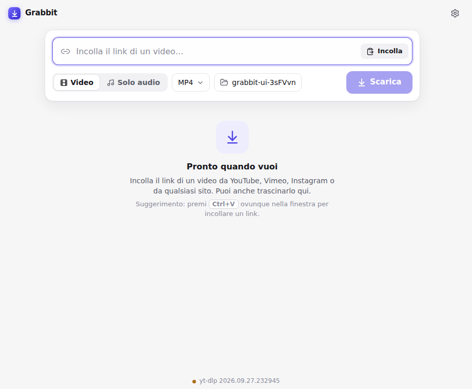
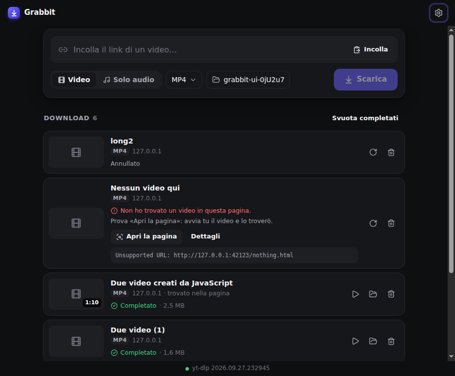
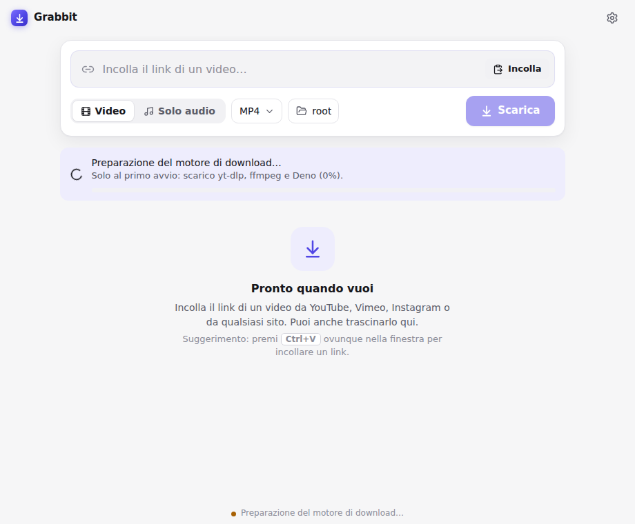
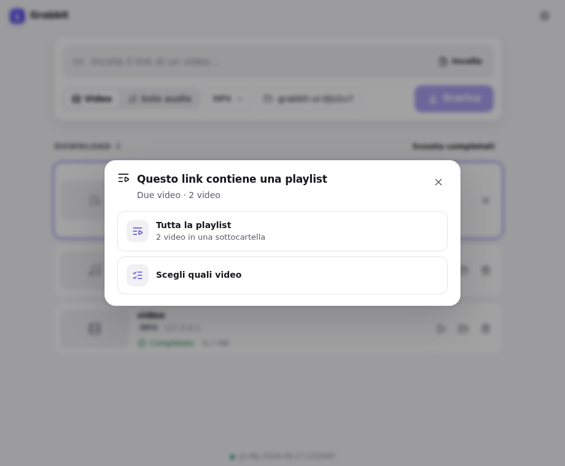
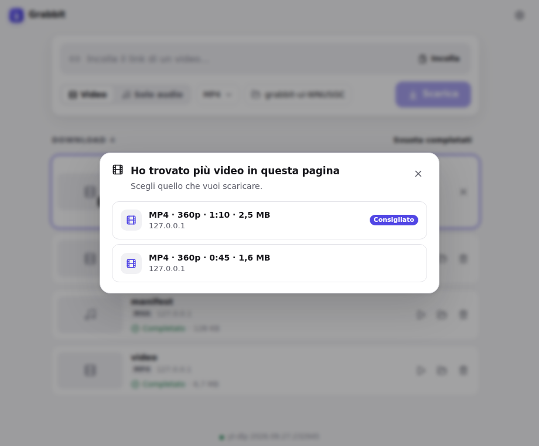

# Grabbit

**Video e audio da qualsiasi sito, alla massima qualità.**
App desktop per **macOS (Apple Silicon)** e **Windows** con un'interfaccia minimal, basata su
[yt-dlp](https://github.com/yt-dlp/yt-dlp), sempre all'ultima versione.

<p align="center">
  
  
</p>

## Cosa fa

- **Incolli un link e scarichi il video** nella massima qualità disponibile: YouTube, Vimeo,
  Instagram, TikTok, X, Facebook e gli oltre 1800 siti supportati da yt-dlp.
- **Funziona anche sui siti che yt-dlp non conosce.** Grabbit apre la pagina in un Chromium
  invisibile e ne osserva il traffico di rete, come fa la scheda *Network* degli strumenti per
  sviluppatori. Trova i flussi `m3u8` (HLS), `mpd` (DASH) e `mp4`/`webm`, scarta pubblicità e
  anteprime e scarica il video migliore. Se trova più video diversi, ti chiede quale vuoi.
- **Formato e cartella a scelta.** Video: **MP4** (predefinito), MKV, WebM, MOV. Solo audio:
  **MP3** (predefinito), M4A, Opus, FLAC, WAV, OGG. Cartella predefinita: **Download**.
- **Massima qualità senza ricodifica**: il video originale viene solo rimesso nel contenitore
  scelto, in pochi secondi e senza perdite. Nelle impostazioni c'è l'opzione *Massima
  compatibilità* (H.264 + AAC) per i file che devono aprirsi ovunque.
- **Playlist**: puoi scegliere tra solo quel video, tutta la playlist o i singoli video da
  selezionare. La playlist viene salvata in una sottocartella.
- **Coda e cronologia**: più download in parallelo, con avanzamento, velocità e tempo rimanente.
  Puoi annullare e riprovare, e la cronologia resta anche dopo la chiusura dell'app.
- **Accesso ai siti**: per i video privati, con limiti d'età o riservati agli abbonati, accedi
  al sito nella finestra integrata. I cookie restano solo sul tuo computer.
- **Copertina e metadati** inclusi nei file (titolo, autore, data, miniatura).
- Italiano e inglese · tema chiaro/scuro automatico · notifiche a download completato.

## Installazione

Scarica l'ultima versione dalla pagina [**Releases**](https://github.com/simonescoca/yt-dlp.app/releases).

### macOS (Apple Silicon)

1. Apri `Grabbit-x.y.z-mac-arm64.dmg` e trascina **Grabbit** in **Applicazioni**.
2. **Solo al primo avvio:** l'app non è firmata con un certificato Apple a pagamento, quindi
   macOS mostra un avviso. Fai **clic destro su Grabbit → Apri → Apri**, oppure vai in
   *Impostazioni di Sistema → Privacy e sicurezza → Apri comunque*.
   Se macOS dice che l'app "è danneggiata", apri il Terminale ed esegui:
   ```sh
   xattr -cr /Applications/Grabbit.app
   ```

### Windows (x64)

1. Esegui `Grabbit-x.y.z-win-x64.exe`. L'app si installa per il tuo utente, senza permessi di
   amministratore, e si avvia da sola.
2. Se compare *"Windows ha protetto il PC"* (SmartScreen), clicca **Ulteriori informazioni →
   Esegui comunque**. Succede perché l'app non ha un certificato di firma a pagamento.

### Primo avvio

Al primo avvio Grabbit scarica il suo motore: **yt-dlp**, **ffmpeg** e **Deno** (il runtime
JavaScript che yt-dlp richiede per YouTube). Serve internet e ci vuole circa mezzo minuto.
Puoi già incollare dei link: partiranno appena il motore è pronto.

<p align="center"></p>

## Come si usa

1. **Incolla un link** nel campo in alto. Puoi anche premere ⌘V / Ctrl+V in qualsiasi punto
   della finestra, o trascinare un link dal browser.
2. Scegli **Video** o **Solo audio**, il **formato** e la **cartella**. Le scelte vengono
   ricordate.
3. Premi **Scarica**.

| | |
|---|---|
|  |  |
| Link con una playlist | Più video trovati in una pagina |

**Se il video non viene trovato**, clicca **Apri la pagina**: si apre il sito, avvii tu il
video, chiudi la finestra e Grabbit lo cattura. Se un video richiede l'accesso, usa
**Accedi al sito** (oppure *Impostazioni → Accesso ai siti*) e poi **Riprova**.

**Se trova solo video di pochi secondi** (anteprime, intro, pubblicità), Grabbit non li scarica
da solo: te li mostra e ti propone **Apri la pagina**, perché di solito il video vero parte
solo dopo un clic sul player.

## yt-dlp sempre aggiornato

Grabbit usa il canale **nightly** di yt-dlp, quello consigliato dagli stessi sviluppatori di
yt-dlp, perché le correzioni per YouTube arrivano in ore invece che in settimane. Grabbit
controlla gli aggiornamenti:

- a ogni avvio;
- ogni 6 ore;
- prima di ogni download, se l'ultimo controllo ha più di un'ora.

Ogni file scaricato viene verificato con il suo checksum SHA-256. Deno si aggiorna ogni giorno,
ffmpeg ogni settimana. In *Impostazioni → Motore* trovi le versioni installate, il pulsante
*Controlla aggiornamenti* e la scelta del canale (nightly o stabile).

## Limiti

- I contenuti protetti da **DRM** (Netflix, Disney+, Prime Video, Spotify…) non si possono
  scaricare. Grabbit lo riconosce e te lo dice.
- **YouTube** a volte blocca alcune reti (per esempio VPN o reti aziendali) con *"Sign in to
  confirm you're not a bot"*. Accedere a YouTube da *Impostazioni → Accesso ai siti* di solito
  risolve.
- Le **dirette in corso** vengono registrate da quando parte il download, ma per ora non c'è
  un pulsante "ferma e salva": se annulli, la registrazione va persa. Le dirette già concluse
  (VOD) si scaricano normalmente.
- Usa Grabbit nel rispetto del diritto d'autore e dei termini dei siti.

## Come funziona

```
┌──────────────── Electron ─────────────────────────────────────────────┐
│  Renderer (React SPA, sandbox)  ◄── IPC tipizzato ──►  Main process  │
│                                                       │               │
│   JobManager: analisi → (playlist?) → (scansione?) → download         │
│        │                │                  │                          │
│        ▼                ▼                  ▼                          │
│   yt-dlp -J        Sniffer: Chromium     yt-dlp + ffmpeg              │
│   (+ Deno)         nascosto,             (merge/remux/estrazione      │
│                    webRequest su tutti   audio, metadati, copertina)  │
│                    i frame, DOM, clic                                 │
│                                                                       │
│   ComponentManager: scarica/aggiorna yt-dlp, Deno, ffmpeg             │
└───────────────────────────────────────────────────────────────────────┘
```

| Cartella | Contenuto |
|---|---|
| `src/main/engine` | Download, verifica e aggiornamento dei componenti (yt-dlp, Deno, ffmpeg) |
| `src/main/ytdlp` | Comandi yt-dlp, analisi, progresso, classificazione degli errori |
| `src/main/sniffer` | Scansione delle pagine "come la tab Network", parser HLS/DASH, ranking |
| `src/main/core` | Coda dei download, impostazioni, cronologia, log |
| `src/main/browser` | Profilo browser per l'accesso ai siti, esportazione dei cookie per yt-dlp |
| `src/renderer` | Interfaccia (React + CSS) |
| `src/shared` | Tipi condivisi tra UI e processo principale |
| `tests/` | Test unitari, di integrazione, dentro Electron ed end-to-end |
| `todo.md` | Piano e diario di sviluppo |

I dati dell'app (motore, impostazioni, cronologia, log) sono in
`~/Library/Application Support/Grabbit` (macOS) e in `%APPDATA%\Grabbit` (Windows).

## Sviluppo

Requisiti: **Node.js 22**.

```sh
npm ci
npm run dev            # app in modalità sviluppo (hot reload)
npm run typecheck
npm test               # test unitari (Vitest)
npm run test:integration   # scarica il motore vero e prova yt-dlp su video di test locali
npm run build
npm run test:electron  # test dello sniffer dentro Electron
npx playwright test    # test end-to-end sull'app vera
```

Su Linux senza display, anteponi `xvfb-run -a` ai comandi che avviano Electron. Con
`GRABBIT_NET_TESTS=1` partono anche i test su siti reali.

**Installer:** `npm run dist:mac` (su un Mac con Apple Silicon) e `npm run dist:win` (su
Windows). In alternativa, con un tag `v*` (es. `git tag v0.1.0 && git push --tags`) il
workflow *Release* di GitHub Actions crea `.dmg` e `.exe` e li pubblica in una Release.
